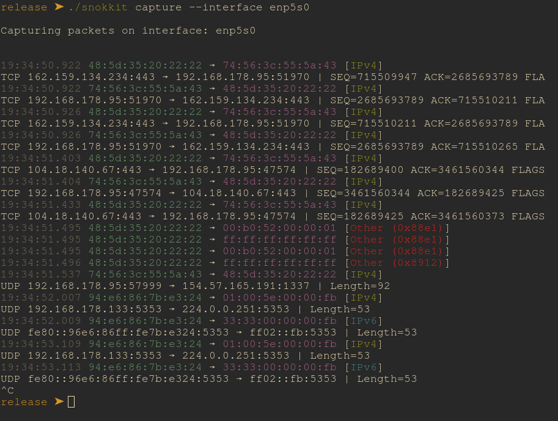

# snokkit
## Unfinished & Under Active Development

## Install

1. Download and move into project root folder
2. Build with ```cargo build --release```
3. Navigate to ```/target/release```

On Linux, you’ll need to run your binary as root (or with CAP_NET_RAW) to access raw packets:

```sudo setcap cap_net_raw=eip ./your-sniffer```

## Usage

Usage: ./snokkit [COMMAND] [FLAG]

Commands:
<ul>
    <li>list     List available interfaces</li>
    <li>capture  Start capturing packets</li>
    <li>export   Export captured packets to a file</li>
    <li>help     Print this message or the help of the given subcommand(s)</li>
</ul>

Options:
  -h, --help     Print help
  -V, --version  Print version


## Example


